## Testes de API

### Criação do banco de dados
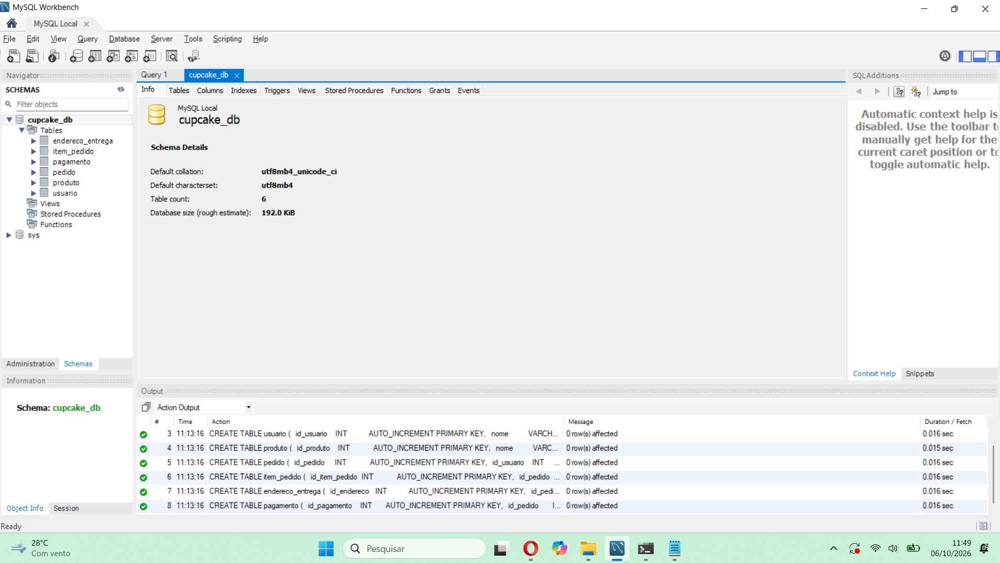

### Conexão com a API realizada
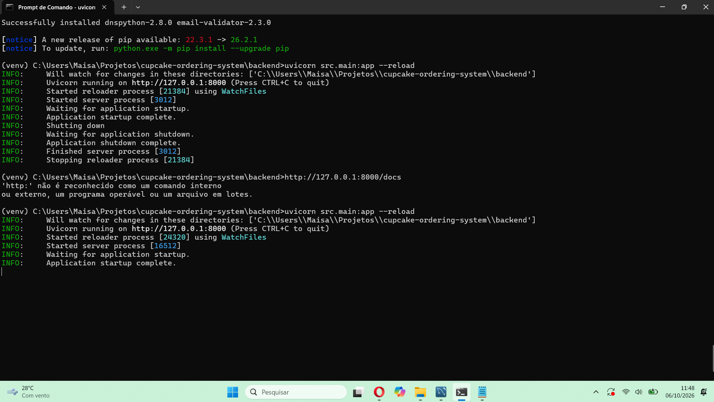

### TC01 — Listar Produtos
Endpoint: GET /produtos/

Status: ✅ PASSOU
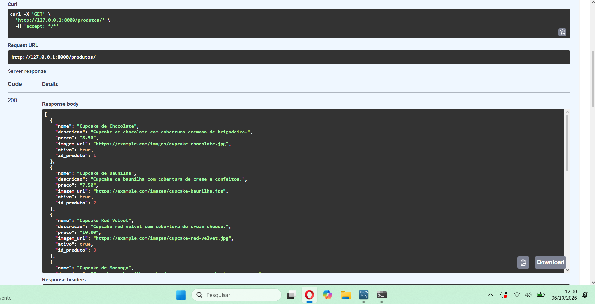

### TC02 — Criar produto
Endpoint: POST /produtos/

Status: ✅ PASSOU
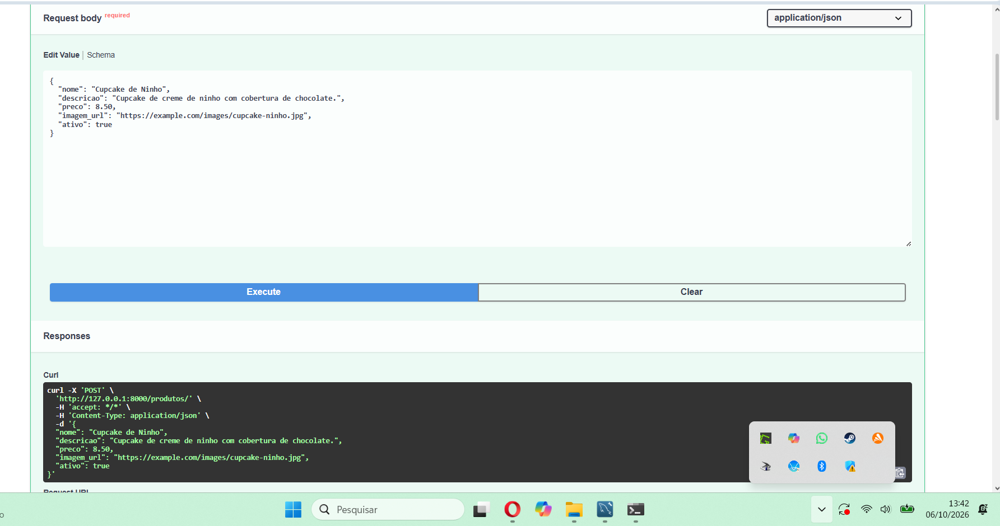

### TC03 — Buscar Produto
Endpoint: GET /produtos/{id_produto}

Status: ✅ PASSOU
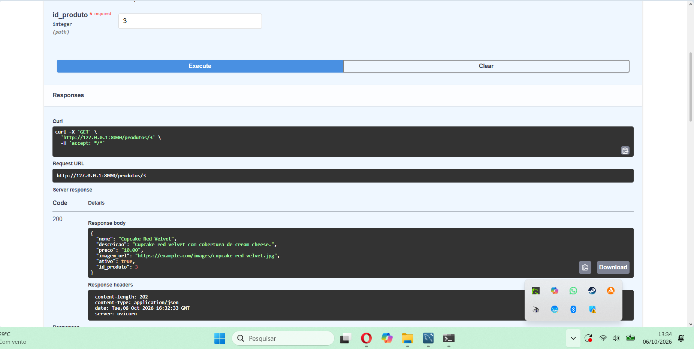

### TC04 — Listar Todos os Produtos
Endpoint: GET /produtos/admin/todos

Status: ✅ PASSOU
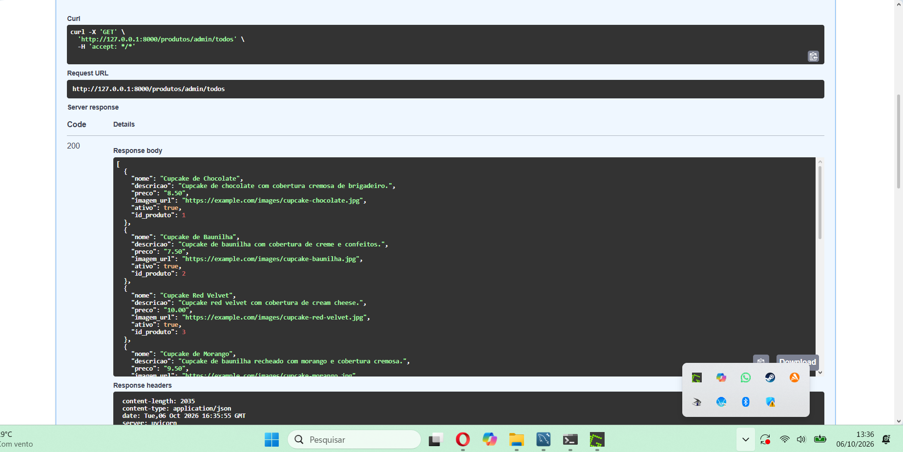

### TC05 — Desativar Produto
Endpoint: PATCH /produtos/{id_produto}/desativar

Status: ✅ PASSOU
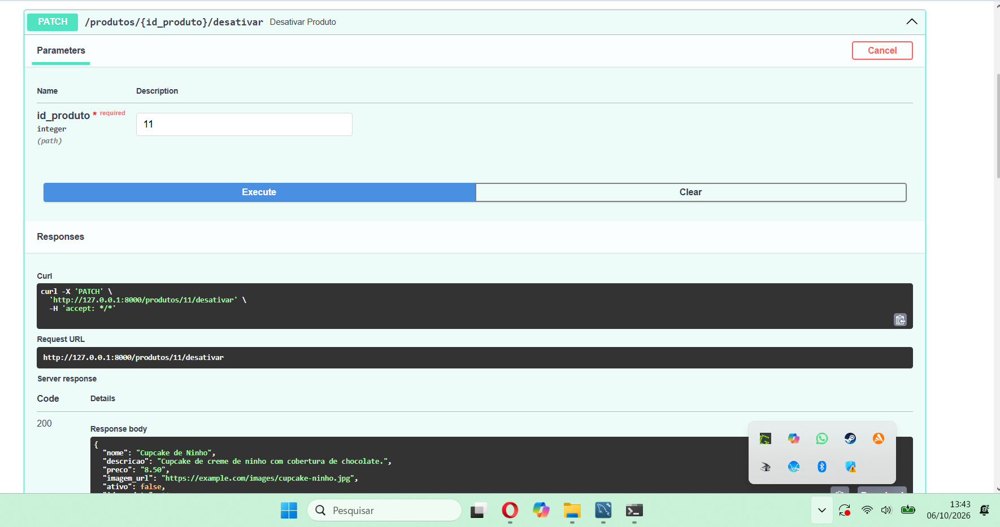

### TC06 — Criar Usuário
Endpoint: POST /usuarios/

Status: ✅ PASSOU
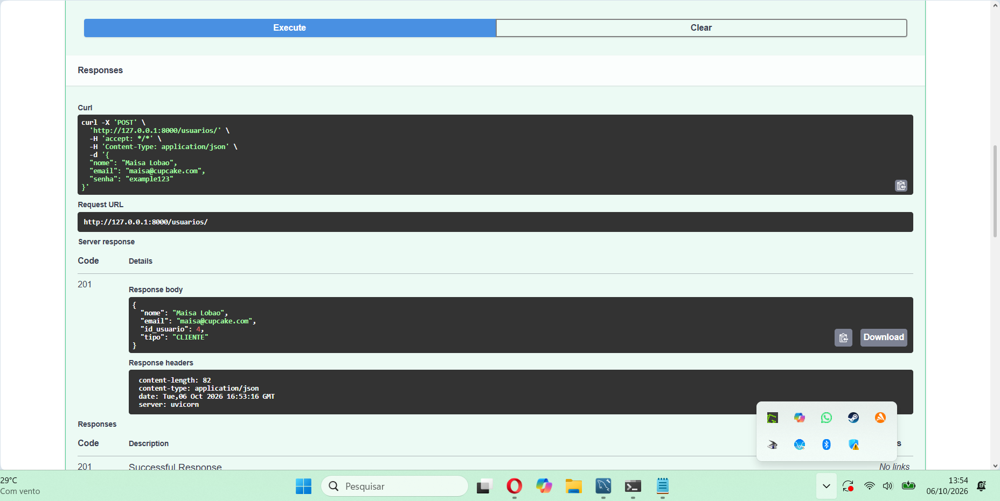

### TC07 — Buscar Usuário
Endpoint: GET /usuarios/{id_usuario}

Status: ✅ PASSOU
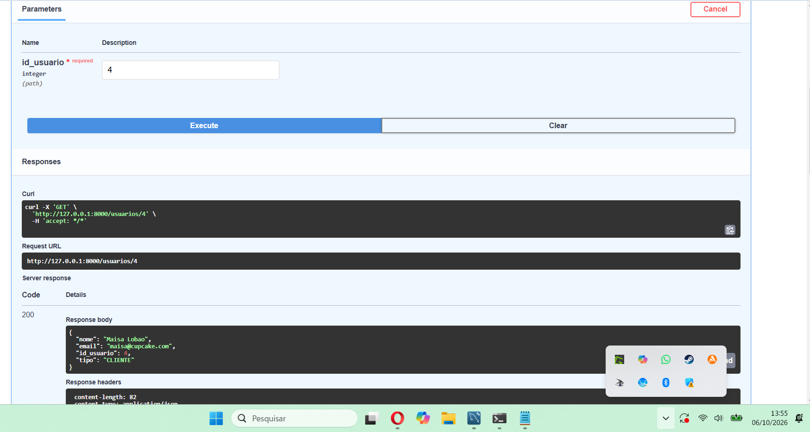

### TC08 — Criar Pedido
Endpoint: POST /pedidos/

Status: ✅ PASSOU
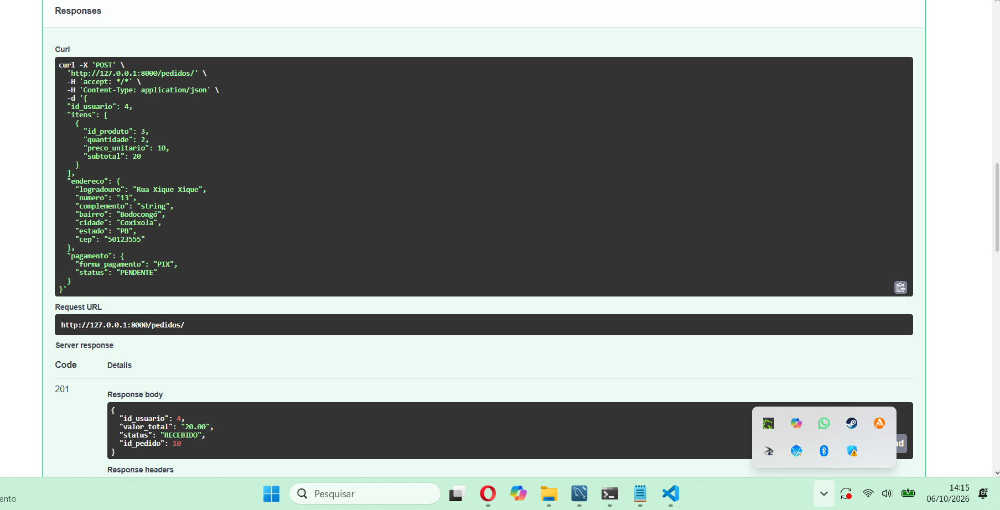

### TC09 — Buscar Pedido
Endpoint: GET /pedidos/{id_pedido}

Status: ✅ PASSOU
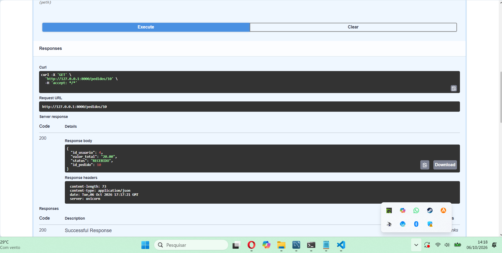

### TC10 — Listar Pedidos Usuário
Endpoint: GET /pedidos/usuario/{id_usuario}

Status: ✅ PASSOU
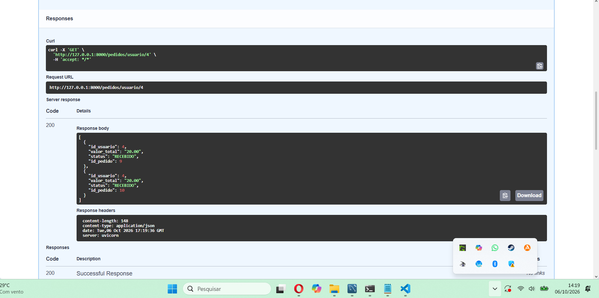

### TC11 — Listar Todos os Pedidos
Endpoint: GET /pedidos/admin/todos

Status: ✅ PASSOU
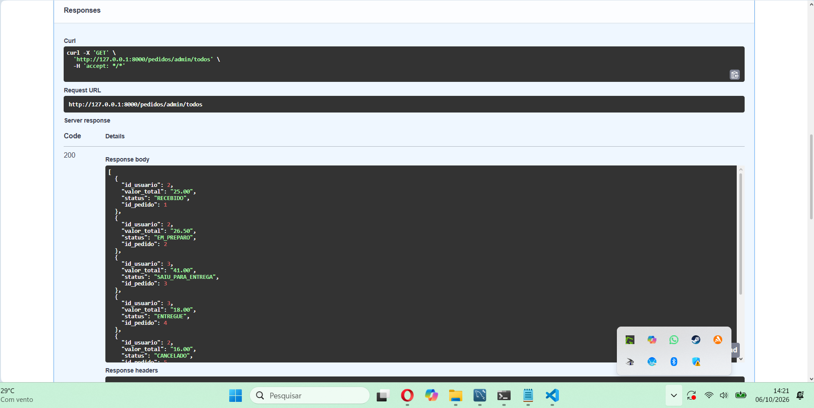

### TC12 — Atualizar Status
Endpoint: PATCH /{id_pedido}/status

Status: ✅ PASSOU
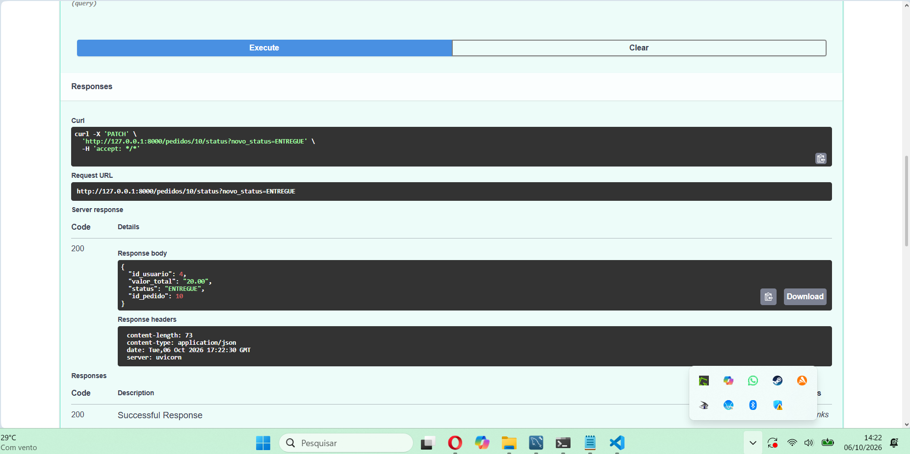

### C01 — Consulta tabela de pedidos
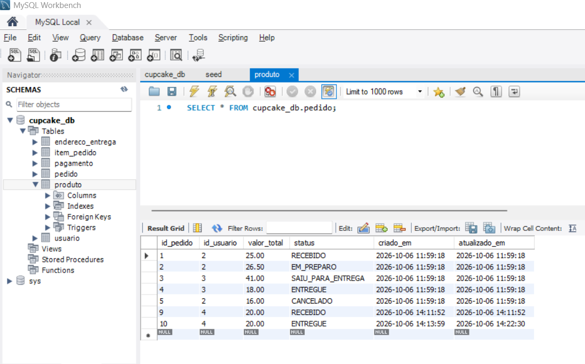

### C02 — Consulta tabela de endereço de entrega
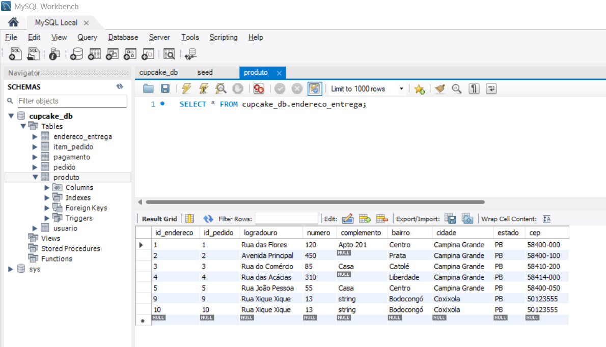

### C03 — Consulta tabela de itens do pedido
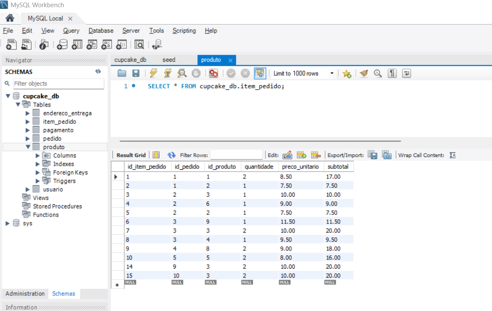

### C04 — Consulta tabela de pagamentos
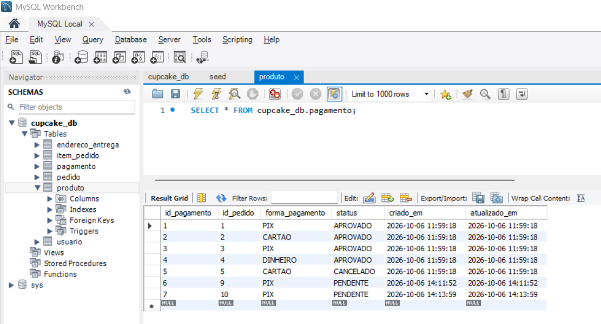

### C05 — Consulta tabela de produtos
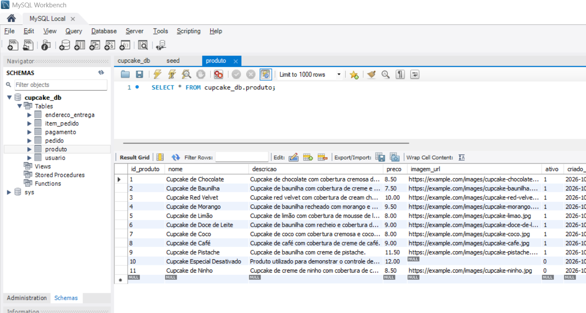
